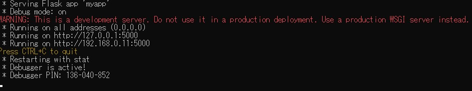
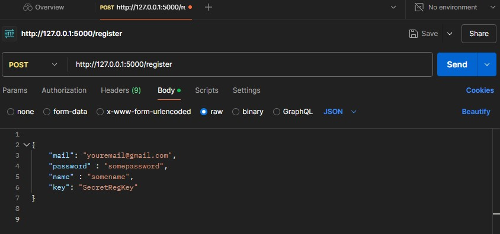
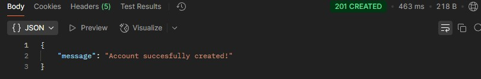
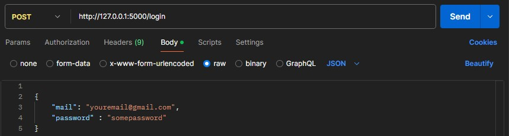
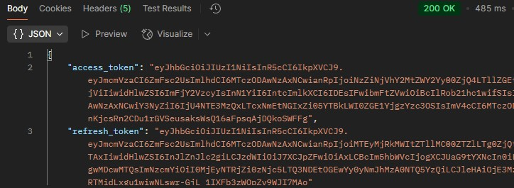
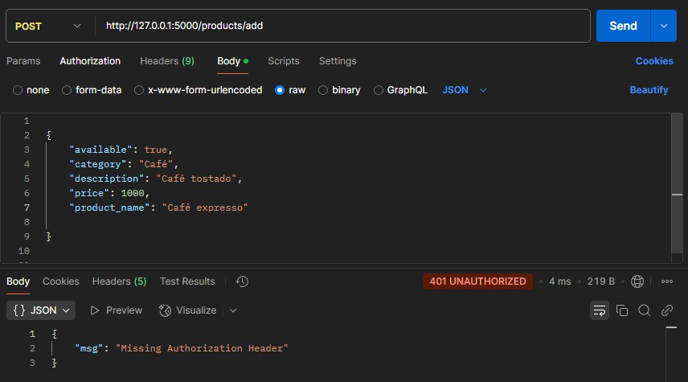
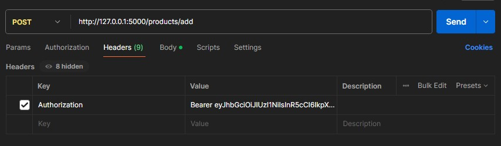

<h1 style="text-align:center"> API Menú digital </h1> 

<strong><h2 style="text-align:center">Descripción</h2></strong>
<h4>API desarrollada para un menú digital donde el cliente del comercio puede ver los productos junto con la descripción y precios de los mismos. El proyecto está dividido en 2 partes:   

- API  

- Aplicación de escritorio.   

En este repositorio solo habrá información de la API. Para la app de escritorio, debes entrar al siguiente repositorio
<a href="https://github.com/ThomySjs/App_productos">App productos</a>.
</h4>

<strong><h2 style="text-align:center">Pequeña historia</h2></strong>
<h4>La idea para este proyecto surgió como solución a un problema que ocurría muy seguido en mi trabajo (una heladería) donde, además de ofrecer el producto principal, también contábamos con una carta de cafetería. Al llenarse el local nos quedábamos sin cartas, por lo que se me ocurrió una forma de no depender de las mismas: &quot;Un menú digital&quot;.    
La primera versión del proyecto era simplemente el menú donde el cliente podía entrar para ver los productos y sus precios. Si bien ese era un buen enfoque, rápidamente me surgió la duda: ¿Qué pasa cuando cambian los precios o en caso de tener que modificar un producto? Por lo que decidí desarrollarlo con la posibilidad de que el empleado pueda editar el menú a conveniencia.
</h4>

<strong><h2 style="text-align:center">Tecnologías y división</h2></strong>
<strong>Tecnologías utilizadas:  

<strong>Backend: </strong>
 &emsp; 
 &emsp;
  
 &emsp;
 
  
&emsp;

<strong>FrontEnd: 
&emsp;

</strong>  
<strong>Base de datos:  </strong>
Como primera opcion decidí utilizar SQLite3 ya que el proyecto está pensado para un local chico que no maneja gran cantidad de datos, por lo que algo simple y ligero es la mejor opción pero termine optando por MySQL debido la imposibilidad de hostear la app utilizando discos persistentes (puedes cambiar a sqlite3 sin necesidad de modificar las tablas). Para las migraciones implementé Alembic.   
<strong>Seguridad:  </strong>

El proyecto cuenta con un sistema de registro y logueo con verificación vía mail utilizando Flask-mail. El registro tiene una clave única necesaria para crear la cuenta.  
Los endpoints cuyo propósito es realizar operaciones CRUD están protegidos por JWT, es decir, para realizar dichas operaciones es necesario estar registrado. Además, utilicé Bcrypt para evitar guardar las contraseñas como texto plano. 

<strong>Escalabilidad:  </strong>
La estructura está bien organizada y utiliza blueprints, permitiendo agregar nuevas funcionalidades sin necesidad de reescribir o modificar código ya existente.

---
<strong><h2 style="text-align:center"> Funcionalidades</h2></strong>

<h3 style="text-align:center"><strong>Página principal.</strong></h3>

<h3><strong>Menú</strong></h3>
<h4>
Retorna una plantilla que utiliza los datos recopilados para mostrarlos en el menú. Las tablas con los productos se generan dinámicamente, es decir, si una categoría no tiene ningún producto disponible, desaparece del menú hasta que vuelva a tener al menos un producto activo. Esto permite agregar nuevas categorías sin necesidad de modificar el código.  
Método : GET  
URL : /Menu  

</h4>

<h3 style="text-align:center"><strong>Inicio de sesión y validaciones.</strong></h3>

<h3><strong>Registro</strong></h3>
<h4>

Método : POST  
URL : /register  
Content-type : application / JSON 
Ejemplo de petición:   
{ 
    &emsp;`name` : "yourname", 
    &emsp;`mail`: "example@gmail.com", 
    &emsp;`password`: "supersecretpassword", 
    &emsp;`key`: "supersecretkey" 
}
</h4>

<h3><strong>Log in</strong></h3>
<h4>

Método : POST  
URL : /login  
Content-type : application / JSON 
Ejemplo de petición:   
{ 
    &emsp;`mail`: "example@gmail.com", 
    &emsp;`password`: "supersecretpassword", 
}
</h4>
</h4>

<h3><strong>Refresh token</strong></h3>
<h4>

Método : POST  
URL : /refresh  
Content-type : application / JSON 
Protección : JWT refresh token.
</h4>

---
<h3 style="text-align:center"><strong>Operaciones CRUD con productos.</strong></h3>

<h3><strong>Obtener productos</strong></h3>
<h4>
Devuelve una lista con los productos e informacion basica de cada uno (Nombre, Precio, Categoria y Descripción).  

Método : GET  
URL : /products  
</h4>

<h3><strong>Obtener productos completos</strong></h3>
<h4>
Devuelve una lista con los productos y la informacion completa de cada uno, incluida la disponibilidad y la ID.  

Método : POST  
URL : /products/data  
Content-type : application / JSON 
Protección : JWT.  
Ejemplo de petición:   
{ 
    &emsp;`order`: "price" 
} 
>Nota: Este endpoint también podría utilizar un método GET y pasar por parámetro en la URL el orden con el que solicita los productos. Simplemente decidí darle otro enfoque pasando el orden a través de un JSON.
</h4>

<h3><strong>Obtener producto por ID</strong></h3>
<h4>

Método : GET  
URL : /products/<int:id>  
Protección : JWT.  
</h4>

<h3><strong>Agregar producto</strong></h3>
<h4>

Método : POST  
URL : /products/add  
Content-type : application / JSON 
Protección : JWT.  
Ejemplo de petición:   
{ 
    &emsp;`product_name`: productname, 
    &emsp;`price`: 1500.0, 
    &emsp;`description`: somedescription, 
    &emsp;`category`: somecategory, 
    &emsp;`available`: False 
}  
</h4>

<h3><strong>Actualizar producto</strong></h3>
<h4>

Método : PUT  
URL : /products/update  
Content-type : application / JSON 
Protección : JWT.  
Ejemplo de petición:   
{ 
    &emsp;`product_id`: 0, 
    &emsp;`product_name`: productname, 
    &emsp;`price`: 1500.0, 
    &emsp;`description`: somedescription, 
    &emsp;`category`: somecategory, 
    &emsp;`available`: True 
}  
</h4>

<h3><strong>Eliminar producto</strong></h3>
<h4>

Método : DELETE  
URL : /products/delete  
Content-type : application / JSON 
Protección : JWT.  
Ejemplo de petición:   
{ 
    &emsp;`product_id`: 0, 
}  
</h4>

<h3><strong>Obtener historial de cambios</strong></h3>
<h4>

Método : GET  
URL : /products/changelog  
Protección : JWT.  
</h4> 

> Para más información sobre los distintos endpoints, puedes revisar la documentación dentro del código. 

---

<strong><h2 style="text-align:center">Cómo probar la API</h2></strong>

<strong><h3>Activar en servidor local</h3></strong>
<h4>
Una vez que hayas clonado el proyecto, dentro de la carpeta principal debes crear un entorno virtual.  
<code>python3 -m venv env</code>  
<code>venv\scripts\ctivate</code>  
Con el entorno virtual creado y activado, ejecuta el siguiente comando para instalar todas las dependencias necesarias.  
<code>pip install -r requirements.txt</code>  
Con todo ya instalado solo queda configurar las variables de entorno (puedes crear un archivo .env).  Ejemplo de cuáles son las variables necesarias.   

`SECRET_KEY` = 'yoursupersecretkey' 
`SECURITY_SALT` = 'somesalt' 
`SQLALCHEMY_DATABASE_URI` = 'sqlite:///example.sqlite3' 
`REGISTRATION_KEY` = 'supersecretregkey' (La clave única de la que hablé más arriba)  

`MAIL_SERVER` = 'smtp.gmail.com'  
`MAIL_PORT` = 587  
`MAIL_USE_SSL` = True  
`MAIL_USE_TLS` = True  
`MAIL_USERNAME` = 'youremail@gmail.com'  
`MAIL_PASSWORD` = 'yourpassword' (Debes habilitar la contraseña de aplicación)  
`MAIL_DEFAULT_SENDER` = 'youremail@gmail.com'  

Por último, queda iniciar la app con el siguiente comando  
<code>python3 run.py</code> 

Si todo salió bien, deberías ver este mensaje en tu línea de comandos 
</h4>
</img>

<strong><h3> Probar con Postman</h3></strong>

<h4>
Primero debemos registrarnos y validar el mail.   

   

Una vez registrados, debemos iniciar sesión y recibiremos el código de acceso como respuesta (además de un refresh token para mantener la sesión).   

  

Accedemos a un endpoint protegido sin el token de acceso para comprobar.   
  

Agregamos el token de acceso al encabezado y hacemos la misma petición.   

  

Puedes seguir probando con los distintos endpoints. Recuerda agregar el token de acceso para las peticiones y nunca compartas las claves secretas de la aplicación.
</h4>
